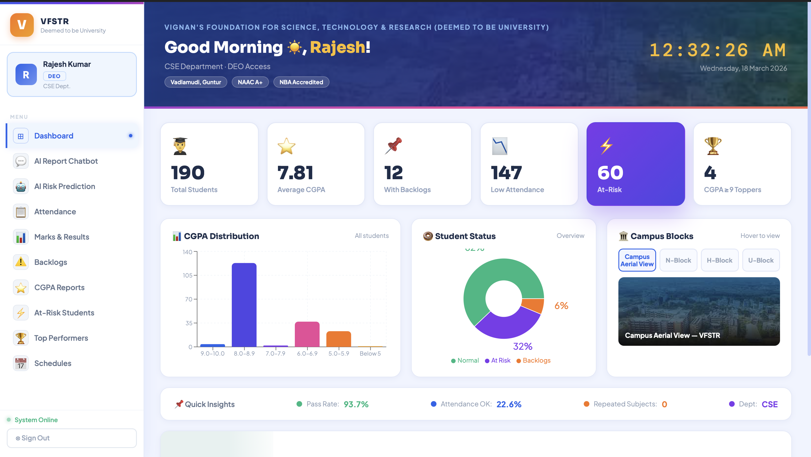

<p align="center">
  
</p>

# DEO Reports

AI-assisted academic reporting system for university DEOs, HODs, faculty, and administrators.

The project combines:
- a React frontend for login, dashboard, chatbot, reports, and scheduling
- an Express + MongoDB backend for auth, reporting, AI parsing, and exports
- AI-powered natural-language query parsing and academic insights

## Features

- Secure login with JWT and role-based access
- Dashboard with summary cards and charts
- Report chatbot with:
  - instant keyword matching for common queries
  - AI parsing for natural-language report requests
  - voice input support
- Report pages for:
  - attendance
  - marks and results
  - backlogs
  - CGPA rankings and distribution
  - at-risk students
  - top performers
- AI risk prediction and department insights
- Excel, CSV, and PDF export
- Report scheduling with saved delivery configuration

## Tech Stack

| Layer | Technology |
| --- | --- |
| Frontend | React 18, Axios, Recharts, XLSX |
| Backend | Node.js, Express |
| Database | MongoDB, Mongoose |
| Auth | JWT, bcrypt |
| AI | Google Gemini via REST API |
| Export | XLSX, CSV, PDFKit, jsPDF |
| Scheduling | MongoDB-backed schedules + cron mailer |

## Project Structure

```text
deoreports/
├── README.md
├── PROJECT_STRUCTURE.md
├── backend/
│   ├── .env
│   ├── package.json
│   ├── server.js
│   ├── scheduleCron.js
│   ├── middleware/
│   │   └── auth.js
│   ├── models/
│   │   ├── Student.js
│   │   └── User.js
│   ├── routes/
│   │   ├── Airoutes.js
│   │   ├── auth.js
│   │   ├── reports.js
│   │   └── students.js
│   └── seed/
│       └── seedData.js
└── frontend/
    ├── .env
    ├── package.json
    ├── public/
    │   ├── index.html
    │   └── campus/
    │       ├── all.jpg
    │       ├── chairman.jpg
    │       ├── h_block.jpg
    │       ├── h_block_new.jpg
    │       ├── home.png
    │       ├── n_block.jpg
    │       ├── u_block.jpg
    │       └── u_block_new.jpg
    └── src/
        ├── App.js
        ├── index.js
        ├── components/
        │   ├── ReportPage.js
        │   └── Sidebar.js
        ├── context/
        │   └── AuthContext.js
        ├── pages/
        │   ├── Chatbot.js
        │   ├── Dashboard.js
        │   ├── LoginPage.js
        │   ├── RiskPrediction.js
        │   └── SchedulePage.js
        └── utils/
            └── exportUtils.js
```

## Available Modules

### Frontend

- `LoginPage.js`
  - login form
  - demo credential shortcuts
  - voice-assisted username entry
- `Dashboard.js`
  - summary metrics
  - CGPA distribution chart
  - status overview
- `Chatbot.js`
  - conversational report requests
  - AI parsing fallback
  - quick prompts and voice input
- `ReportPage.js`
  - reusable filter + results UI for all core reports
- `SchedulePage.js`
  - create, list, and delete saved report schedules
- `RiskPrediction.js`
  - consumes AI risk endpoints for advanced analytics

### Backend

- `auth.js`
  - login
  - current user
  - admin user listing
- `students.js`
  - student listing
  - metadata for filters
- `reports.js`
  - attendance
  - marks
  - backlogs
  - CGPA
  - at-risk
  - top performers
  - summary
  - PDF export
  - schedule CRUD
- `Airoutes.js`
  - natural-language report parsing
  - AI insights
  - academic risk prediction
- `scheduleCron.js`
  - scheduled report processing and mail delivery

## Setup

### Prerequisites

- Node.js 18+ recommended
- MongoDB database
- npm

### 1. Backend

```bash
cd backend
npm install
```

Create `backend/.env`:

```env
MONGO_URI=mongodb://localhost:27017/deoreports
JWT_SECRET=replace_this_with_a_real_secret
PORT=5001
FRONTEND_URL=http://localhost:3000
GEMINI_API_KEY=your_gemini_api_key

# Optional: only needed for scheduled email delivery
SMTP_HOST=smtp.gmail.com
SMTP_PORT=587
SMTP_USER=your_email@gmail.com
SMTP_PASS=your_app_password
SMTP_FROM=VFSTR Reports <your_email@gmail.com>
```

Seed the database:

```bash
node seed/seedData.js
```

Start the backend:

```bash
npm run dev
```

Backend default URL:

```text
http://localhost:5001
```

### 2. Frontend

```bash
cd frontend
npm install
```

Create `frontend/.env`:

```env
REACT_APP_API_URL=http://localhost:5001/api
```

Start the frontend:

```bash
npm start
```

Frontend default URL:

```text
http://localhost:3000
```

## Demo Login Credentials

These are created by the seed script.

| Role | Username | Password | Scope |
| --- | --- | --- | --- |
| Admin | `admin` | `admin123` | All departments |
| DEO (CSE) | `deo_cse` | `deo123` | CSE only |
| DEO (ECE) | `deo_ece` | `deo123` | ECE only |
| HOD (CSE) | `hod_cse` | `hod123` | CSE only |
| Faculty (CSE) | `faculty_cse` | `faculty123` | CSE only |

## Example Chatbot Queries

- `Show attendance for CSE section A`
- `Low attendance students below 75%`
- `Internal marks report semester 2`
- `Backlogs for ECE`
- `Top 10 CGPA performers`
- `At-risk students batch 2022-2026`
- `CGPA distribution for CSE`

## API Overview

### Auth

- `POST /api/auth/login`
- `GET /api/auth/me`
- `GET /api/auth/users`

### Students

- `GET /api/students`
- `GET /api/students/meta`

### Reports

- `GET /api/reports/summary`
- `GET /api/reports/attendance`
- `GET /api/reports/marks`
- `GET /api/reports/backlogs`
- `GET /api/reports/cgpa`
- `GET /api/reports/risk`
- `GET /api/reports/top-performers`
- `GET /api/reports/export-pdf`
- `POST /api/reports/schedule`
- `GET /api/reports/schedules`
- `DELETE /api/reports/schedule/:id`

### AI

- `POST /api/ai/query`
- `GET /api/ai/predict-risk`
- `GET /api/ai/insights`

### Health

- `GET /api/health`

## Notes

- The backend currently defaults to port `5001`.
- The chatbot uses fast local parsing for common report phrases and falls back to AI when needed.
- Scheduled report delivery depends on SMTP settings being configured.
- Do not commit real API keys, SMTP passwords, or production secrets to the repository.
